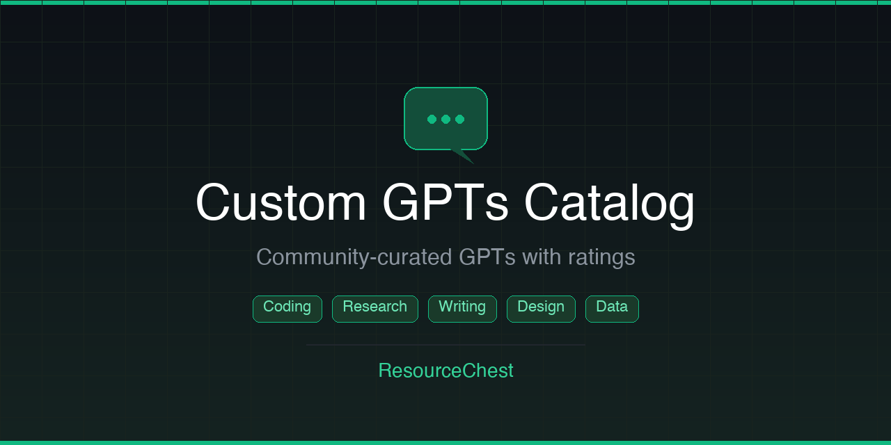

  

# Custom GPTs

A curated catalog of useful Custom GPTs for ChatGPT Plus, Team, and Enterprise users. Custom GPTs extend ChatGPT with specialized instructions, knowledge, and actions -- turning it into a purpose-built tool for coding, research, design, writing, and more.

## Contents

- [Rating System](#rating-system)
- [Coding & Development](#coding--development)
- [Research & Academic](#research--academic)
- [Writing & Content](#writing--content)
- [Image & Design](#image--design)
- [Productivity & Business](#productivity--business)
- [Data & Analysis](#data--analysis)
- [Education & Learning](#education--learning)
- [Contributing](#contributing)
- [Disclaimer](#disclaimer)

## Rating System

Community ratings help surface the best GPTs. To vote:

- **Thumbs up** -- use the [Like template](https://github.com/ResourceChest/custom-gpts/issues/new?template=1-thumbs-up-rating.md&title=Rating+Up+%5BGPT+ID%5D) and put the GPT ID in the title.
- **Thumbs down** -- use the [Dislike template](https://github.com/ResourceChest/custom-gpts/issues/new?template=2-thumbs-down-rating.md&title=Rating+Down+%5BGPT+ID%5D) and put the GPT ID in the title.

Ratings are processed automatically and reflected in the tables below.

---

## Coding & Development

| ID | Name | Description | Tags | Rating |
|----|---|-------|---|-----|
| 7 | [Grimoire](https://chatgpt.com/g/g-n7Rs0IK86-grimoire) | Create a website (or anything) with a sentence. Fullstack coding wizard. | `Website`, `Fullstack` | 0 |
| 8 | [Code Copilot](https://chatgpt.com/g/g-2DQzU5UZl-code-copilot) | Code smarter with expert assistance for debugging, optimization, and best practices. | `Coding`, `Debugging` | 0 |
| 4 | [React AI](https://chatgpt.com/g/g-AVrfRPzod-react-ai) | Your React companion. | `React`, `Tutor` | 1 |
| 5 | [Python Arcade Tutor](https://chatgpt.com/g/g-INDKlxDEO-python-arcade-library-tutor) | Educational GPT expert in the Python Arcade library. | `Python`, `Tutor` | 0 |
| 9 | [Diagram GPT](https://chatgpt.com/g/g-alKfVrz9K-diagram-gpt) | Turn descriptions into diagrams. Supports flowcharts, sequence diagrams, and more. | `Diagrams`, `Visualization` | 0 |
| 10 | [Whimsical Diagrams](https://chatgpt.com/g/g-3w1rEXGE0-whimsical-diagrams) | Generate flowcharts, mind maps, and sequence diagrams directly in chat. | `Diagrams`, `Mind Maps` | 0 |

## Research & Academic

| ID | Name | Description | Tags | Rating |
|----|---|-------|---|-----|
| 6 | [Consensus](https://chatgpt.com/g/g-bo0FiWLY7-consensus) | Search 200M+ academic papers, get science-based answers, and draft content with citations. | `Research`, `Academic Papers` | 0 |
| 11 | [Scholar GPT](https://chatgpt.com/g/g-B3hgivKK9-scholar-gpt) | Research assistant that finds, summarizes, and cites academic literature. | `Research`, `Literature Review` | 0 |
| 12 | [Academic Research Pro](https://chatgpt.com/g/g-3s6SJ5V7S-academic-research-pro) | Advanced academic research companion for papers, theses, and literature reviews. | `Research`, `Academic Writing` | 0 |
| 13 | [Wolfram](https://chatgpt.com/g/g-pcoHeADVw-wolfram) | Access computation, math, curated knowledge, and real-time data through Wolfram Alpha and Language. | `Math`, `Computation` | 0 |

## Writing & Content

| ID | Name | Description | Tags | Rating |
|----|---|-------|---|-----|
| 14 | [AI Humanizer](https://chatgpt.com/g/g-9PKhaweyb-ai-humanizer) | Rewrite AI-generated text to sound more natural and human. | `Writing`, `Humanizer` | 0 |
| 15 | [SEO GPT](https://chatgpt.com/g/g-hxDOCBQrs-seo-gpt) | SEO-focused content strategy and optimization assistant. | `SEO`, `Marketing` | 0 |

## Image & Design

| ID | Name | Description | Tags | Rating |
|----|---|-------|---|-----|
| 16 | [DALL-E](https://chatgpt.com/g/g-2fkFE8rbu-dall-e) | Official DALL-E GPT for generating images from text prompts. | `Image Generation`, `DALL-E` | 0 |
| 17 | [Image Generator](https://chatgpt.com/g/g-IFTpJapfX-image-generator) | Generate images with detailed prompt engineering and style control. | `Image Generation`, `Art` | 0 |
| 18 | [Logo Maker](https://chatgpt.com/g/g-gFt1ghYJl-logo-maker) | Design professional logos from a description. | `Logo`, `Branding` | 0 |
| 19 | [Logo Creator](https://chatgpt.com/g/g-pmuQfob8d-logo-creator) | Create custom logo designs with multiple style options. | `Logo`, `Design` | 0 |
| 20 | [Photo Realistic GPT](https://chatgpt.com/g/g-WKIaLGGem-photo-realistic-gpt) | Generate photorealistic images with enhanced prompt techniques. | `Image Generation`, `Photorealism` | 0 |
| 21 | [Cartoon Yourself](https://chatgpt.com/g/g-TRx6oDFu1-cartoon-yourself) | Turn your photos into cartoon-style illustrations. | `Image`, `Cartoon` | 0 |
| 22 | [Canva](https://chatgpt.com/g/g-dHq8Bxx92-canva) | Design presentations, social media posts, and more with Canva integration. | `Design`, `Canva` | 0 |

## Productivity & Business

| ID | Name | Description | Tags | Rating |
|----|---|-------|---|-----|
| 2 | [FastGPT](https://chatgpt.com/g/g-VnlKc5BQK-fastgpt) | Faster than any other GPT. Like ChatGPT but without the waffle. | `ChatGPT`, `Speed` | 0 |
| 3 | [DesignerGPT](https://chatgpt.com/g/g-2Eo3NxuS7-designergpt) | Creates and hosts beautiful websites. | `Website`, `Creation` | 0 |
| 23 | [Finance Wizard](https://chatgpt.com/g/g-aIWEfl3zH-finance-wizard) | Financial analysis, budgeting guidance, and investment insights. | `Finance`, `Analysis` | 0 |
| 24 | [MS Excel](https://chatgpt.com/g/g-GbLbctpPz-ms-excel) | Excel formula expert. Get help with formulas, pivot tables, and spreadsheet automation. | `Excel`, `Spreadsheets` | 0 |

## Data & Analysis

| ID | Name | Description | Tags | Rating |
|----|---|-------|---|-----|
| 25 | [Data Analyst](https://chatgpt.com/g/g-HMNcP6w7d-data-analyst) | Upload data files and get analysis, visualizations, and insights. | `Data`, `Analytics` | 0 |
| 26 | [AI PDF](https://chatgpt.com/g/g-TgjKDuQwZ-ai-pdf) | Upload and chat with PDFs. Summarize, extract, and answer questions from documents. | `PDF`, `Documents` | 0 |

## Education & Learning

| ID | Name | Description | Tags | Rating |
|----|---|-------|---|-----|
| 1 | [Talk To YouTube Video](https://chatgpt.com/g/g-ynY1wMTRY-talk-to-youtube-video) | Enhance your understanding of YouTube content with interactive Q&A. | `Summarize`, `YouTube` | 2 |
| 27 | [Video GPT by VEED](https://chatgpt.com/g/g-pNWGgUYqS-video-gpt-by-veed) | Create short videos with AI-generated scripts, voiceovers, and visuals. | `Video`, `Creation` | 0 |

## More from ResourceChest

| Repository | Description |
|:--------|:------|
| [Chrome Privacy Extensions](https://github.com/ResourceChest/chrome-privacy-extensions) | Curated Chrome extensions for privacy and security |
| [AI Agents](https://github.com/ResourceChest/ai-agents) | Practical AI agents, frameworks, and tools for developers |
| [FinOps Tools](https://github.com/ResourceChest/finops-tools) | Vendor-neutral tools for cloud cost optimization |
| [Local-First Tools](https://github.com/ResourceChest/local-first-tools) | Local-first, offline-capable, privacy-respecting tools |
| [Dev Tools (No Signup)](https://github.com/ResourceChest/dev-tools-no-signup) | Free developer tools that work instantly without an account |
| [AI & LLM Papers](https://github.com/ResourceChest/ai-llm-papers) | Foundational and frontier AI/LLM research papers reading list |

> **[Follow ResourceChest](https://github.com/ResourceChest)** for more curated resource collections.

---

## Contributing

Want to add a GPT or improve the list? See our [CONTRIBUTING.md](https://github.com/ResourceChest/.github/blob/main/CONTRIBUTING.md) for guidelines.

## Disclaimer

The resources listed here are compiled from community contributions and research. Please review and verify before use. Listings do not imply endorsement.
